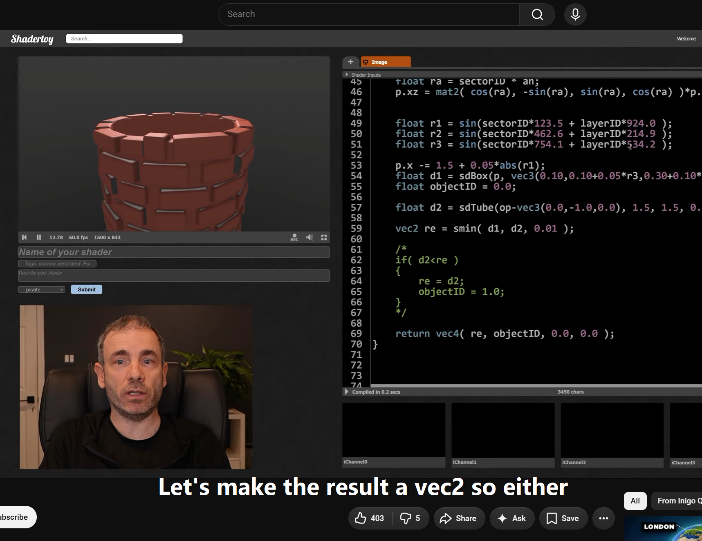

#### Live subtitles from desktop audio auto translated to English

<table>
  <tr>
    <td></td>
    <td></td>
  </tr>
</table>

### How To Use
``` bash
python -m venv .venv
./.venv/Scripts/activate
pip install -r requirements.txt
python subtitles.py
```
##### Controls
- `Drag` to move subtitle window
- `Esc` to exit
- `Scroll` change font size
- `Space` toggle background
- `T` toggle translation
- `S` toggle soft shadow

### Notes
- Uses whisper-large-v3 for transcription & translation
- If something doesn't work submit an issue
- Only works on Windows
