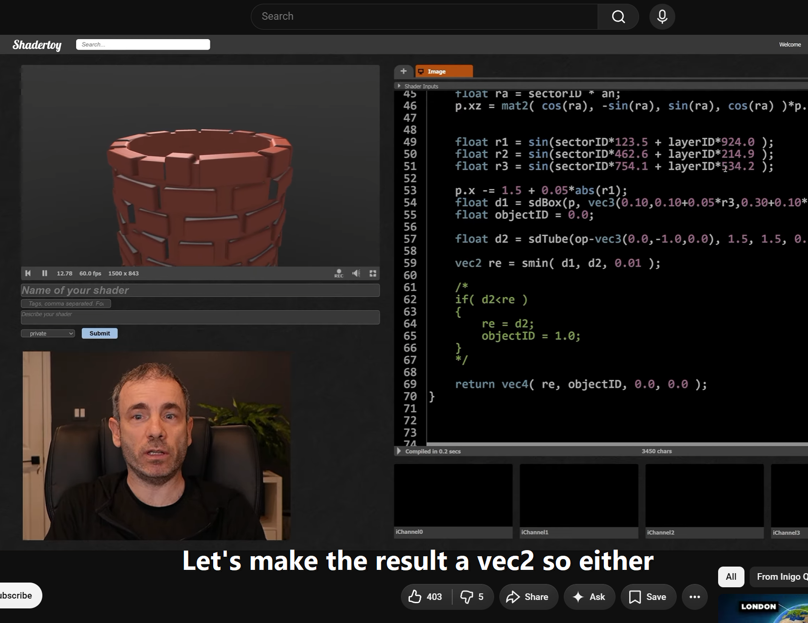

#### Live subtitles from desktop audio auto translated to English

<table>
  <tr>
    <td></td>
    <td></td>
  </tr>
</table>

### How To Use
``` bash
python -m venv .venv
./.venv/Scripts/activate
pip install -r requirements.txt
python subtitles.py
```
##### Controls
- **Tray icon**: left-click to show the subtitles and reset their position; right-click for settings and `Exit`
- `Right-click` the subtitles for the same menu
- `Drag` to move subtitle window
- `Hover` the small idle handle to bring back the last lines
- `Scroll` change font size
- `Space` toggle background
- `T` toggle translation
- `S` toggle between hard and soft text shadow
- `H` toggle shrinking to a small handle when nobody is speaking
- `Esc` to exit

Settings and window position are remembered in `%APPDATA%\Transcriber\settings.json`.

### Notes
- Uses whisper-large-v3 for transcription & translation
- White words are settled and will not change; grey words at the end of a line are still being recognized
- If something doesn't work submit an issue
- Only works on Windows
